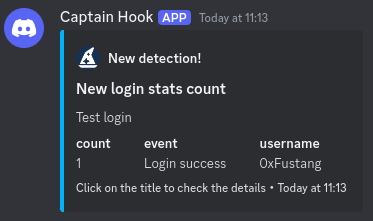

# elastic-alerts-discord

This repository allows you to send Elastic alerts to Discord for free using a webhook.

When using the Elastic suite on-prem for free, the alerts connector is not included. However, you can use the [index connector](https://www.elastic.co/guide/en/kibana/current/index-action-type.html) to ingest the alert events.



## Configuration

To make it work, follow these steps when creating an alert:

1. When creating an alert, rename the output fields to `display_myfield` so that the script can process them and display only the necessary fields for the context.

_For example:_

```text
from awesome-gems*
| where event.module.keyword == "gem" and message.keyword == "Login success"
| rename message.keyword as display_event, gem_user as display_username
| stats display_count = count() by display_event, display_username
```

Note: The script will remove the `display_` prefix when sending the alert to Discord, so you will only have `count`, `event`, and `username`.

2. In the action, select the index connector and name it _"alerts_index"_. Choose the action frequency _"For each alert"_ and insert the following document index configuration:

```json
{
    "@timestamp": "{{date}}",
    "rule_id": "{{rule.id}}",
    "rule_name": "{{rule.name}}",
    "rule_description": "{{context.rule.description}}",
    "rule_url": "{{rule.url}}",
    "alert_id": "{{alert.id}}",
    "context": "{{context.alerts}}"
}
```

Note: You have the option to modify the index name in the script as well.


## Launching the script

When launching the script manually or via Docker, provide the following environment variables to the running system:

```
export ES_URL="https://pastas.internal:9200"
export ES_USER="user"
export ES_PASSWORD="password"
export DISCORD_WEBHOOK_URL="https://discord.webhook/EEEEEE/AAAAA"
export ICON_URL="https://avatars.githubusercontent.com/u/35560225?v=4"
```

Note: The script will fetch the alerts from the past 5 minutes every 5 minutes. Feel to modify the script or fork the repo.

# License

GPLv3